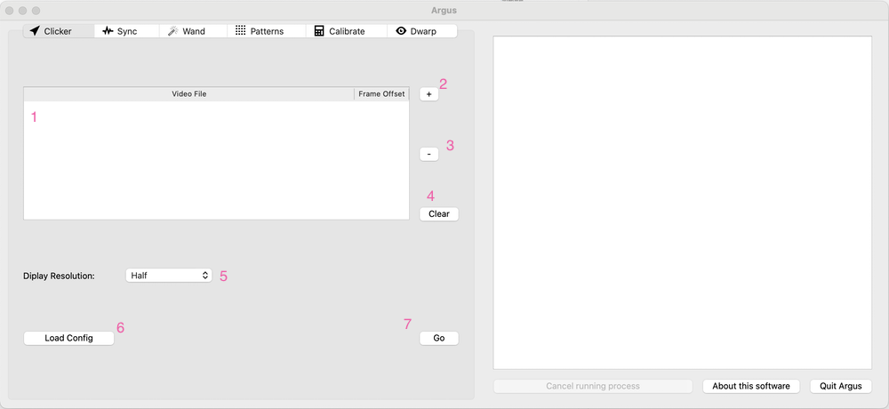
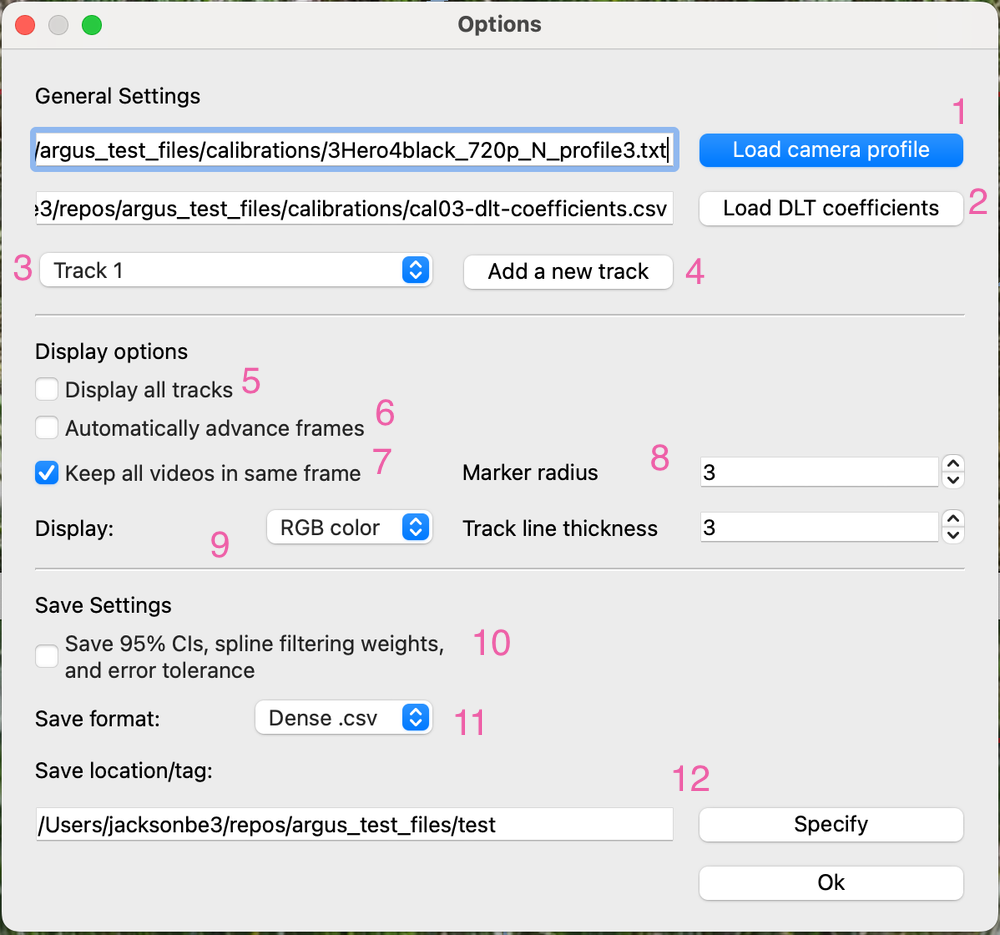
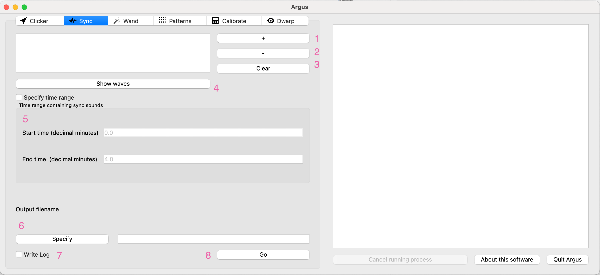
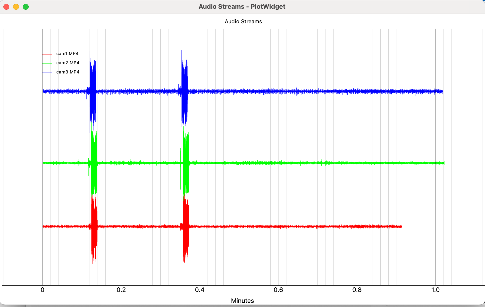
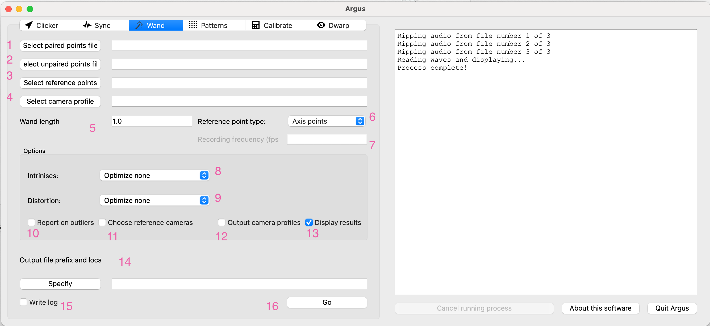
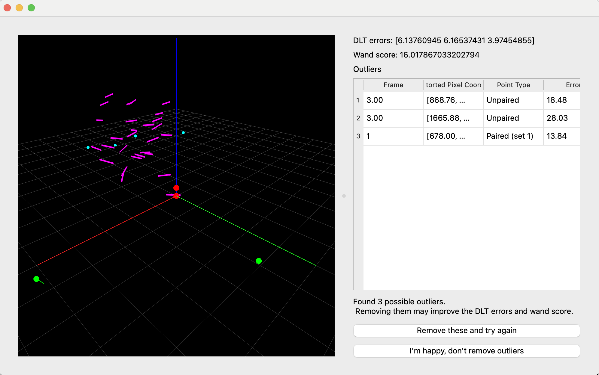
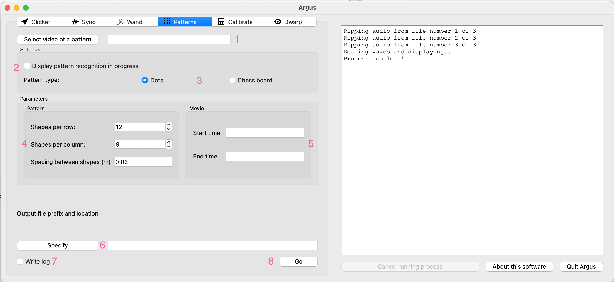
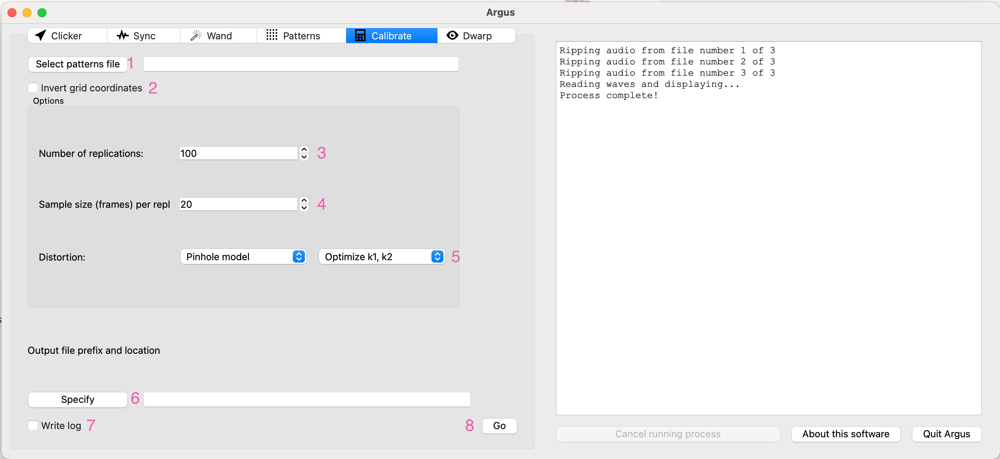
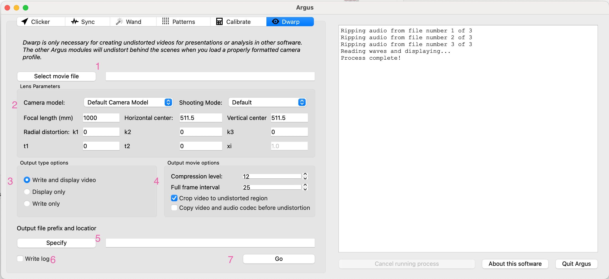

# User Guide

Welcome to the comprehensive user guide for Argus GUI. This guide covers all aspects of using the software for 3D camera calibration and reconstruction.

## Table of Contents

1. [Interface Overview](#interface-overview)
2. [Clicker](#clicker)
3. [Sync](#syncp)
4. [Wand](#wand)
5. [Patterns](#patterns)
6. [Calibrate](#calibrate)
7. [Dwarp](#dwarp)
8. [Data Collection Workflow](#data-collection-workflow)

## Interface Overview

The Argus GUI displays tabs for each module, allowing you to switch between different functionalities easily. The left side of the GUI allows you to select files and change settings, while the right side displays some important text outputs of all of the modules. Each tab is independent, so you can load different files or settings in each tab without affecting the others. However you should only have one process running at a time. You can use the `Cancel running process` button to stop any currently running process, such as calibration or reconstruction.

## Clicker

Several imporant steps of the 3D reconstruction process are performed by marking and tracking individual points in multiple videos. Clicker is where you can view and navigate through videos while placing markers. 

### Main GUI Elements



1. Video List: Displays loaded videos and frame offsets. The first camera has an offset of 0. 
2. `+` Button: Add a new video to the list. After selecting a video, you will be prompted to set the frame offset for that camera. You can edit that offset by double-clicking the offset value in the table, and by using the ⬆ and ⬇ keys while viewing the video.
3. `-` Button will remove the selected video from the list.
4. `Clear` button will clear all videos from the list.
5. `Display Resolution`: Select `Half` resolution for large videos if you are working on a small screen (e.g. laptop) or if you want faster processing. Otherwise, select `Full` resolution for best quality. Video windows can be resized once displayed. All coordinates will be converted to the original resolution when saving no matter what resolution you select.
6. `Load Config`: Load a configuration file that is saved from a previous session. If you use this, you do **not** need to add videos to the list. After selecting your config file the tracking interface will load.

### Clicker Video Interface


Each video will open in a separate window. The window title has several important pieces of information:
1. Video file name
2. Displayed frame number
3. Frame offset (relative to the first camera)
4. Current track name

Markers from all frames of the current Track will be displayed by default. Lines connect makers from consecutive frames. You can change the size of the markers in the options dialog.

The marker representing the current current track in the current frame is highlighted in a larger pink circle.

Light blue lines display the epipolar lines that show a predicted position based on marker positions in the current frame in other cameras and the 3D reconstruction (so they only display if you have loaded a camera profile and DLT coefficients, and placed markers in other cameras).

### Video Controls

- `Left click`: Place a marker at the current frame position. If a marker already exists, it will be updated to the new position.
- `Right click` or `d`: Delete the marker at the current frame position in the active camera.
-  `shift-d`: Delete the current track (with confirmation dialog). You cannot delete the only track, so you may need to add a new track first.
- `=`: Zoom in on the video. `-`: Zoom out. You can also use the mouse wheel to zoom in and out. Zooming will center on the current mouse cursor position.
- `r`: Reset the zoom level to the default.
- `Shift + Left Click and drag`: Pan in the image
- `f`: Move forward one frame. `F`: Move forward 50 frames.
- `b`: Move backward one frame. `B`: Move backward 50 frames.
- `g`: Go to a specific frame number. A dialog will open to enter the frame number.
- `,`: switch to the previous track.
- `.`: switch to the next track.
- `➡`: Go to the next frame with a marked position in the current track.
- `⬅`: Go to the previous frame with a marked position in the current track.
- `⬆`: Increase the frame offset for the current camera by 1. This will move the video forward in time.
- `⬇`: Decrease the frame offset for the current camera by 1. This will move the video backward in time.
- `shift-C`: set directory to save captured images to
- `alt-C`: capture the current frame to the specified directory (not currently functional)
- `o`: Open the [options dialog](#clicker-options-dialog) to change settings for the current project.
- `s`: Save the project data. Will prompt for a file name and location if not already set.
- `ctrl-s`: Save as... will prompt for a file name and location to save the current project data.
- `v`: toggle the display of the view finder in the lower right corner.
- `x`: toggle the 'sync' option which keeps all videos on the same frame. Can also be set in the options dialog.
- `7`: Grow the view-finder vertically by a pixel
- `U`: Shrink the view-finder vertically by a pixel
- `Y`: Grow the view-finder horizontally by a pixel
- `I`: Shrink the view-finder horizontally by a pixel
- `P`: Plot 3D positions (requires DLT coefficients and a camera profile)
- `L`: Load saved points (from .csv or .tsv file)

### Clicker Options Dialog

With any video window active, you can open the options dialog by typing `o` . This dialog allows you to configure various settings for the Clicker module that affect the current project rather than specific videos. All settings shown are saved to the project configuration file when you save the project.



1. Navigate to and select a camera profile that contains the camera intrinsics for your specific camera. You can use one of the included profiles or build your own using **Patterns** and **Calibrate**. This is required for 3D reconstruction.
2. Navigate to and select a DLT coefficients file that contains the camera extrinsics for your specific camera. You can use **Wand** to determine the DLT coefficients for a camera set up based on points tracked in **Clicker**. This is required for 3D reconstruction.
3. Currently active track name. Use the dropdown to select a different track, or use the `,` and `.` keys to switch tracks in the video window instead of opening this dialog.
4. To add a new track, click this button and enter a name for the new track.
5. `Display all tracks` checkbox: If checked, all tracks will be displayed in the video window. If unchecked, only the current track will be displayed. This may slow down the video display if there are many tracks and points.
6. `Automatically advance frames` when placing markers. If checked, the video will automatically advance to the next frame after placing a marker. If unchecked, you will need to manually advance frames using the `f` key.
7. `Keep all videos on the same frame` checkbox: If checked, all videos will be synchronized to the same frame when placing markers. If unchecked, each video can be advanced independently. Keeping this checked may slow down the video display on some computers.
8. Change the marker size and track line thickness display. This is display only, and does not affect the saved data.
9. `Display`: Select `RGB color` or `grayscale` for the video display. Grayscale may be faster for large videos.
10. ` Save 95% CI...` checkbox. If checked, a bootstrapping algorithm based on the 3d reconstruction error will be used to compute a 95% confidence interval for the 3D position of each marker in each frame. This will slow down the saving process, but will provide a more accurate estimate of the uncertainty in the 3D positions.
11. Save format: Select `Dense .csv` or `Sparse .tsv` for saving the tracked points. Dense format saves all frames with and without markers, while sparse format only saves frames where markers are present. Dense format is more generally useful for analysis, while sparse format is more compact for very long videos espeically with many frames without markers.
12. `Save location/tag`: Click to select the directory where the project data will be saved. The dialog will require you to enter a file "tag" (on windows you will also need to add a file extension, which will be removed. This will be used for saving the tracked points and other project data. Depending on options above, this will save muliple files all starting with the same tag, appended with additional information and the file extension. For example, if you enter "trial01" as the tag, and have entered a camera profile and dlt coefficients the following files will be saved:
   - `trial01-xypts.csv` (or .tsv)
   - `trial01-xyzpts.csv` (or .tsv)
   - `trial01-offsets.csv` 
   - `trial01-res.csv` (or .tsv) - the 3D reconstruction errors for each marker for each frame
   - `trial01-config.yaml` - the project configuration file containing all settings and metadata
   - other files will be saved in the 95% CI option is selected

## Sync

Before analyzing videos in **Clicker**, you need to determine the synchronization offsets between cameras. The **Sync** module provides tools to synchronize multiple video files based on their audio tracks. We suggest repeated loud sounds delivered directly to each camera. See [the paper](/docs/citation.md) for some details on how to synchronize cameras using sound. 



1. **Add Video**: Click the `+` button to add a video file to the list. You should add all videos from your cameras for a specific trial. Make sure you load them in the same order you will load them in **Clicker**. 
2. **Remove Video**: Select a video and click the `-` button to remove it from the list.
3. **Clear List**: Click the `Clear` button to remove all videos from the list.
4. **Show Waves**: Click the `Show Waves` button to display the audio waveforms for all loaded videos. This will open a new window showing the audio waveforms for each video, which can help you visually identify synchronization points.



5. **Specify Time Range**: Long videos, especially with low sync-signal-to-noise-ratios may not syncrhonize accurately if the full video is used. Use the waveform display to determine the approximate start and end time (in decimal minutes) of your synchronization sequence, and enter those values in `Start Time` and `End Time` fields.
6. **Output filename**: Specify the output filename for the synchronization results. By default this will be named based on the first video loaded in the list, with `_offsets.csv` appended, saved to the same directory as the first video. You can change this to any valid filename, but it must end with `.csv`. This file will contain the time and frame offsets for each camera, plus an confidence score for the synchronization. The confidence score is based on the correlation between the audio waveforms of the cameras.
7. **Write Log**: If checked, a log file will be created with the output that is printed to the right side of the window. 
8. **Go**: Click this button to start the synchronization process. The software will analyze the audio tracks of the loaded videos and attempt to find the best synchronization offsets based on the specified time range. 

## Wand

Camera extrinsics (location and orientation relative to a common coordinate system) are determined by waving a "wand" with two markers in front of the cameras to provide a known distance calibration. **Wand** uses the wand (or "paired") points, and other unpaired points (these can be static objects in the background, or moving subjects), tracked in **Clicker**, along with camera intrinsics, and processed through sparse bundle adjustment to optimize camera extrinsics. It can also further optimize camera intrinsics. The output is a DLT coeffients file than can be loaded into **Clicker** for 3D reconstruction of tracks. 



1. **Select paired points file**: This should be a `-xypts.csv` file saved from **Clicker** containing two tracks that mark two points a constant distance apart. The distance between these two points will be used to determine the scale of the 3D reconstruction.
2. **Select unpaired points file**: This should be a `-xypts.csv` file saved from **Clicker**. These can be static objects in the background, or moving subjects as long as the same actual object is accurately tracked in multiple cameras in the same time-synced frames. The more of the filming volume covered by unpaired points, the better the camera extrinsics will be estimated. These should all be in a single clicker track. 
3. **Select reference points file**: This should be a `-xypts.csv` file saved from **Clicker** containing a single track that marks 1-4 points in all cameras. This will be used to determine the origin and orientation of the coordinate system for the 3D reconstruction: 1 point will set the origin, 2 points will set the z-axis (plumb line), 3 points will set a horizontal plane with the z-axis calculated, and 4 points will set the origin, x, y, and z axes with the right-hand rule. You can also track a free-falling object in the filming volume, such as a ball, and select "Gravity" as the point type to calculate the z-axis. 
4. **Select camera profile**: This should be a camera profile file that contains the camera intrinsics for your specific camera. You can use one of the included profiles or build your own using **Patterns** and **Calibrate**.
5. **Wand Length**: Enter the length of the wand. The units used here will set the units for the 3D reconstruction.
6. **Referecne Point Type**: Select the type of reference points you are using. This will determine how the coordinate system is set up. Options for static objects include `Axis` (1, 2, or 4 poitns), or `Plane` (3 points). If you are using a free-falling object, select `Gravity`.
7. **Recording frequency**: This is the camera recording frequency for the free-falling object for a `Gravity` reference point type.
8. **Intrinsics** and **Distortion**: Specifiy which camera intrinsics and distortion parameters you would like to optimizein the sparse bundle adjustment based on the paired and unpaired points. You can also use the intrinsics from the camera profile (`Optimize none`).
10. **Report on outliers**: If checked, the software will report on outliers in the paired and unpaired points after the sparse bundle adjustment and give the option to remove the outliers and re-run the optimization. This is automatic if you also selsect **Display results**. 
11. **Choose reference camera**: Optimize the choice of reference camera such that there are the most 3D triangulatable points, i.e. camera with the most shared information.
12. **Output camera profiles**: Good to use if you optimized intrinsics and distortion as those new values will be saved in a new camera profile to be used in **Clicker**. 
13: **Display results**: If checked, the software will display the results of the sparse bundle adjustment in a new window. This will show the 3D positions of the paired and unpaired points, the reference points, and allow you to visualize the camera extrinsics. This will also include an outlier detection and removal step.
14. **Output file prefix and location**: The default is the same directory as the paired points file, with `_cal` added. This will save a number of files depending on the options selected, all starting with the file prefix. 

15. **Write log**: If checked, a log file will be created with the output that is printed to the right side of the window.
16. **Go**: Click this button to start the sparse bundle adjustment process. If `Display results` is checked, the window below will open showing the results of the sparse bundle adjustment. 



The 3D plot of the calibration scene can be navigated using the mouse:
- Left click and drag to rotate the view
- Cmd-click (macOS) or Ctrl-click (Windows/Linux) and drag to pan the view
- Scroll wheel to zoom in and out

Colors are as follows:
- **Paired points**: magenta lines
- **Unpaired points**: cyan dots
- **Reference points**: red dots
- **Cameras**: green dots

- The `DLT errors` shows the rmse reconstruction error for each camera, which is the average distance between the marked 2D position in the video and the 3D position projected back to the 2D camera using the DLT coefficients.  Very good calibrations will have DLT errors of less than 1 pixel.
- The `Wand Score` is calculated as $100 * \frac{std_{wand}}{mean_{wand}}$, where `std_wand` is the standard deviation of the calculated wand length across all cameras, and `mean_wand` is the mean calculated wand length across all cameras. Good calibrations generally have a wand score of approximately 1.0 or less. 

### Output Files
Depending on the options selected, the following files will be saved to the output directory with the specified prefix:
- `*_dlt-coefficients.csv` - DLT coefficients file for use in **Clicker** (camera extriniscs).
- `*_-sba-profile.txt` - Camera profile file with optimized intrinsics and extrinsics. This is for compatibility with DLTdv and easyWand, and should not be used in **Clicker**. Each row represents a camera with the following columns:
     - fx - focal length for x in pixels
     - cx, cy - principal point in pixels, typically in middle of image
     - AR - aspect ratio, typically 1.
     - s - skew, typically 0.
     - r2,r4 - radial distortion coeffs according to Bourguet (dimensionless) (same as k1, k2 in OpenCV)
     - t1,t2 - tangential distortion coeffs (dimensionless)
     - r6 - radial distortion coeff according to Bourguet (dimensionless) (same as k3 in OpenCV)
     - q0,qi,qj,qk - unit quaternion rotation of camera (dimensionless)
     - tx,ty,tz - translation of camera in real world units
- `*_-sba-profile-orig.txt` - a the same profile above before full optimization
- `*-clicker_profile.txt` - a version of `sba-profile.txt` formatted for direct loading into **Clicker** assuming the cameras are loaded in the same order, with the following columns:
     - camera number
     - fx - focal length for x in pixels
     - image width, height
     - cx, cy - principal point in pixels, typically in middle of image
     - AR - aspect ratio, typically 1.
     - r2,r4- radial distortion coeffs according to Bourguet (dimensionless) (same as k1, k2 in OpenCV)
     - t1,t2 - tangential distortion coeffs (dimensionless)
     - r6 - radial distortion coeff according to Bourguet (dimensionless) (same as k3 in OpenCV)
- `*_unpaired-points-xyz.csv` - The 3D positions of the unpaired points after the sparse bundle adjustment
- `*_paired-points-xyz.csv` - The 3D positions of the paired points after the sparse bundle adjustment
- `*_cal-camera-N-profile.txt` - one profile file per camera with the same output as the "clicker" profile above but without image width and height. This is only output if "output camera profiles" is checked.

## Patterns



1. **Select video of a pattern**. This should be a video of a calibration pattern, such as a checkerboard or circle grid for a single camera. The video should be a short clip of the pattern being moved around in front of the camera, with the pattern visible in multiple frames. The pattern should be well-lit and in focus, and fill 1/3-2/3 of the frame, at multiple distances and angled ± 15° from the camera. 
2. **Display pattern recognition in progress**: If checked, the software will display the pattern recognition process in a new window. If partial patterns are detected, the detections will be displayed in red. When the full pattern is detected, the detections will be displayed with rainbow colors. If the full pattern is viisible but not detected with rainbow colors, that indicates a problem with the other settings, such as the pattern size or the number of corners, or a problem with the video itself, such as poor lighting or focus.
3. **Pattern type**: Select the type of pattern you are using: `Dots` or `Chess board`. 
4. **Pattern**: Size of the pattern described in "shapes per row" and "shapes per columns" (not number of columns or rows). For a chess board, this is the number of inner intersections in each direction (number of squares - 1). For a dot pattern, this is the number of dots in each direction. The `spacing between shapes (m)` is the distance between the centers of adjacent dots, or the length of a chessboard square, in meters. This is used to determine the size of the pattern in real-world units.
5. **Start time** and **End time**: Specify the time range in the video to analyze for the pattern. This is useful if the pattern is only visible in a specific part of the video, or if the video is long and you want to speed up processing.
6. **Output filename**: Specify the output filename for the pattern recognition results. By default, this will be the directory and name of the camera, with `_patterns.pkl` appended. You can change this to any valid filename, but it must end with `.pkl`. This file will contain the detected pattern points and their 2D positions in the video frames.
7. **Write log**: If checked, a log file will be created with the output that is printed to the right side of the window.
8. **Go**: Click this button to start the pattern recognition process. The software will analyze the video and attempt to detect the specified pattern.

## Calibrate
 

 1. **Select patterns file**: This should be a `-patterns.pkl` file saved from **Patterns** containing the detected pattern points and their 2D positions in the video frames.
 2. **Invert grid coordinates**. Useful for adapting to different pattern orientations. If calibration RMSE are high, try inverting the grid coordinates. The log should print alerts suggesting this if the RMSE is high.
 3. **Number of replications**: The number of times the calibration will be repeated, with each attempt using a random sub-sample of the detected pattern points. Larger numbers of replications will provide a more robust calibration, but will take longer to compute.  Default is 100.
 4. **Sample size (frames) per replication**: The number of frames to use for each replication of the calibration. This should be less than the total number of frames in the video, and should be large enough to provide a good sample of the pattern points. Larger numbers may provide a more robust calibration, but will make each replication take longer to compute and may cause memory issues on some computers. Default is 20. 
 5. **Distortion**: Select the type of distortion model to use for the calibration. Options are `Pinhole model`, `omnidirectional` (CMei). With the pinhole model, the user can select to optimize the first two radial coefficients, all radial coefficients,  or all distortion (radial and tangential) coefficients. 
 6. **Output filename and location**: The default is the same directory as the patterns file, and the same name, but with `.csv` extension. This will open in a spreadsheet like Excel, and show the results of all replications. The user should view this to determine the best combination of coefficients for their use. 
 7. **Write log**: If checked, a log file will be created with the output that is printed to the right side of the window.
 8. **Go**: Click this button to start the calibration process. Each replication will be displayed in the log, and the best results will be printed at the end. The output file will contain the results of all replications, including the RMSE for each replication.


## Dwarp


>[!NOTE]
> The **Dwarp** module is only necessary for creating undistorted videos for presentation or analysis in other software. The othe Argus modules, like **Clicker**, will apply undistortion algorithms to the data when camera profiles have been loaded, so you do not need to use this module for 3D reconstruction or tracking. You can track points on the distorted video and the 3D positions will be undistorted automatically when you save the data. Also, recent GoPro models include a "linear" shooting mode that undistorts the video in-camera, so you may not need to use this module at all if you are using a GoPro camera. We highly recommend using the linear shooting modes if available. 

1. **Select movie file**: This should be a video file that you want to undistort using the camera profile.
2. **Camera profile**: You can select an included camera model and shooting mode which will set the profile elements automatically, or you can manually enter the profile values. 
3. **Output type options**: `Display` will show a live preview of the undistorted video. `Write` saves the video. `Display only` is useful for testing the undistortion without the time or energy needed to save. `Write only` is useful for processing large videos without displaying them once the undistortion parameters are set.
4. **Output movie options**: 
  + `Compression level`: must be an integer between 0 and 63, 0 being no compression (lossless) and 63 being maximal compression. Consult FFMPEG's documentation for more information on the `crf` parameter. 
  + `Full frame interval`: The number of frames between full saved frames. Smaller numbers may result in smoother video but will take longer to process and require more disk space. 
  + `Crop video to undistorted area`: If checked, the video will be cropped to the undistorted area, which may result in a smaller video file size but loss of areas outside the crop. If unchecked, the undistored video will be saved over a light-blue background. 
  + `Copy video and audio codec before undistorting`: If checked, the video and audio codecs will be copied from the original video file before undistorting. This will result in a faster processing time but may not work with all video formats on all computers.
5. **Output filename and location**: The default is the same directory as the movie file, and the same name, but with `_dewarped.MP4` appended. You can change this to any valid filename, but it must end with `.MP4`.
6. **Write log**: If checked, a log file will be created with the output that is printed to the right side of the window.
7. **Go**: Click this button to start the undistortion process.

## Data collection workflow

This guide will walk you through the basic steps to set up a multi-camera project, record videos, and collect 3D data using Argus

### Workflow Overview

1. **Determine camera instrinics**. This should be done before recording research videos, and is best performed in a controlled environment. These parameters will likely be fixed for your camera setup, so you can save them and reuse them for future projects with the same cameras on the same settings. Argus comes with camera instrinsics for some common cameras, but you can also create your own using the **Patterns** and **Calibrate** modules.
2. **Camera setup for data collection**. Set up your cameras in a fixed position, ensuring they are synchronized and have overlapping fields of view. Use tripods or mounts to keep cameras stable.
3. **Record wand and data videos**
4. **Determine DLT coefficients**. This is done using the **Wand** module, which uses the wand points and other unpaired points tracked in **Clicker** to optimize camera extrinsics.
5. **Track points in videos**. Use the **Clicker** module to mark and track data points to save 3D positions.

#### Step 1: Determine Camera Intrinsics
Camera intrinsics are the internal parameters of a camera that affect how it captures images. These include focal length, principal point, and distortion coefficients. Action cameras like GoPro often have fairly wide-angle lenses with significant distortion, so it is important to calibrate them for accurate 3D reconstruction. However, many cameras now can shoot in "linear" modes which use factory calibration to undistort the video in-camera. We strongly recommend using these modes if available as they greatly reduce the complexity of the calibration process. In fact, if you are using a GoPro or other camera with a linear shooting mode, you can skip the calibration steps below and skip to [create a camera profile](#create-a-camera-profile).

> [!NOTE] 
> We've included instrinsics for some common cameras in the [`resources/calibrations`](../resources/calibrations) directory. If you are using one of these cameras and shooting modes, you can skip the calibration steps below and [create a camera profile](#create-a-camera-profile) based on the included numbers.

Argus divides the intrinsic-calibration process into mulitple steps, all of which should be completed in controlled environments before recording research videos:
+ Use the **Patterns** module to detect calibration patterns in video files.
+ Use the **Calibrate** module to perform the calibration based on the detected patterns.
+ We recommend using additional refinement steps.

1. **Record a calibration video**: Record a video of a calibration pattern, such as a [dots grid](../resources/patterns/dots-9x12_2cm.pdf). 
   + The pattern should be well-lit and in focus.
   + The pattern must be mounted absolutely flat.
   + The pattern can be fixed and the camera moved, or the camera fixed and the pattern moved. 
   + The distance between the camera and pattern should be such that the pattern fills 1/3 - 2/3 of the frame, at multiple distances and angles ± 15° from the camera.
   + Be sure to use the same camera settings (resolution, frame rate, shooting modes, etc.) that you will use for your research videos.
   + Even if you are shooting in a "linear" mode that undistorts the video in-camera, you should still record a calibration video to determine the focal length as this will be needed for 3D reconstruction.
2. **Find the offsets**: If you are using multiple cameras, you will need to determine the synchronization offsets between them. This is done using the [**Sync**](#sync) module. 
   + Load all of the calibration video files into the Sync module.
   + Use the audio tracks to find synchronization points, such as a loud clap or other sound that is recorded by all cameras at the same time.
   + Save the synchronization offsets to a `.csv` file.
2. **Track the pattern**: Open the [**Patterns**](#patterns) module and load the calibration video file.
   + Select the pattern type (dots or chessboard) and specify the pattern size (number of shapes per row and column).
   + Set the spacing between shapes (for dots) or the size of a square (for chessboard) in meters.
   + Specify the start and end time of the video to analyze (this is to avoid spending time analyzing long sections where the pattern may not be visible).
   + Click "Go" to start the pattern recognition process. The software will analyze the video and attempt to detect the specified pattern. This will create a `.pkl` file with the detected pattern points and their 2D positions in the video frames.
3. **Calibrate the camera**: Open the [**Calibrate**](#calibrate) module and load the patterns file created in the previous step.
   + Specify the number of replications and sample size per replication.
   + Choose your optimization options. GoPros in "narrow" shooting modes should use the `Pinhole model` with the first two radial coefficients optimized. We recommend other cameras use relatively narrow modes. 
   + If your camera has a significant amount of distortion, you can use the `omnidirectional` model and optimize all distortion coefficients, but the best results may be achieved by using Scaramuzza's omnidirectional model (calibrated with [Ocam Calib](https://sites.google.com/site/scarabotix/ocamcalib-omnidirectional-camera-calibration-toolbox-for-matlab/ocamcalib-toolbox-download-page), a MATLAB toolbox). There is also a [Python implementation](https://github.com/jakarto3d/py-OCamCalib) of this model, but we have not yet tested it.
   + Click "Go" to start the calibration process. The software will analyze the detected pattern points and perform the calibration, creating a `.csv` file with the results of all replications, including the RMSE for each replication. This provides a starting point for making a camera profile, noting that the single replication with the lowest RMSE may not be the best profile. However, the lowest RMSE result is also saved as a `-profile.txt` file: a single row with the following camera instrinsics:
     - camera index number (1 for the first camera, used when loading profiles into Wand and Clicker) 
     - focal length in pixels (fx)
     - image width and height in pixels
     - principal point in pixels (cx, cy) - half of width and height for most cameras
     - aspect ratio (AR), typically 1
     - radial distortion coefficients (r2, r4)
     - tangential distortion coefficients (t1, t2)
     - radial distortion coefficient (r6) - optional, used for some cameras

##### Create a camera profile
You need to now make a `profile.txt` that contains the instrics for all of your cameras you will use in a multi-camera setup. This is done by creating a new text file and copying the instrinsics from the `-profile.txt` file created in the previous step.  
    + If all of your cameras are the same model and shooting mode, you can duplicate the single row in the file that **Calibrate** produced, changing only the first column (the camera index). 
    + If you have different cameras or shooting modes, each row of the `-profile.txt` file will need to be different. 
    + The order of the cameras in the profile must match the order in which you will load the cameras in the **Clicker** and **Wand** modules.

If you are using a GoPro or other camera with a linear shooting mode, create a "dummy" profile to provide a starting point for refinement. For example, if you are using three cameras all with an output resolution of 1920x1080, you can create a profile with the following values:

```
1 1000 1920 1080 959.5 539.5 1 0 0 0 0 0
2 1000 1920 1080 959.5 539.5 1 0 0 0 0 0
3 1000 1920 1080 959.5 539.5 1 0 0 0 0 0
```
The first column is the camera index (1, 2, 3), the second column is the focal length in pixels (1000 is a good starting point), the third and fourth columns are the image width and height in pixels (1920 and 1080 ), the fifth and sixth columns are the principal point in pixels (half of width and height for most cameras), the seventh column is the aspect ratio (1 for most cameras), and the last five columns are distortion coefficients, which can be set to zero for a linear shooting mode.

Save that file as a text file with a descriptive name, such as `preliminary-profile.txt`.

##### Calibration Refinement

We have found that the best results for 3D reconstruction are achieved by using the camera profile created in the previous step, but then refining the calibration using the **Wand** module which has additional optimization options. 

1. **Record a wand video**: This should be done is a controlled setting with optimal lighting and camera placement.
    + Set cameras to the same settings as will be used for data recordings.
    + Place the cameras similarly (distance to target and to each other) as you will for data recording. The best 3D reconstructions have inter-camera distances equal to approximatly half the camera-to-target distance. Cameras should not be co-linear.
    + Record a video of a wand with two markers fixed-distance from each other in front of the cameras. The wand should be moved slowly around in front of the cameras, with the markers visible in multiple frames. The distance between the markers should be constant, and the markers should be well-lit and in focus. The wand should be moved in a way that fills the filming volume, and oriented in all directions.
    + Ideally, other objects should be visible or added to the filming volume, such as a static objects in the background or a slowly moving subject, to provide additional unpaired points for the calibration.
    + Cameras should be synchronized using light or [sound](#sync). 
    + This video should also include a reference objection to provide an origin and orientation for the 3D reconstruction. There are options for 1, 2, 3, or 4 points, or a free-falling object.
    + We also recommend recording a ground-truth test video, for example of a free-falling ball, or an object of known length that is different than the wand, to test the accuracy of the calibration.
2. **Find the offsets**: If you are using multiple cameras, you will need to determine the synchronization offsets between them. This is done using the [**Sync**](#sync) module. 
   + Load all of the calibration video files into the Sync module.
   + Use the audio tracks to find synchronization points, such as a loud clap or other sound that is recorded by all cameras at the same time.
2. **Track the wand points**: Open the [**Clicker**](#clicker) module and load the wand video files from all cameras, inputting the frame offsets for each.
    + Track the two markers on the wand in each camera. This requires two tracks, one for each marker.
    + There is no need to track the markers in every frame, but you should track them in enough frames to cover the filming volume and angles.
    + The most important variable to keep in mind is that any given frame, the same absolute marker should be marked with the same track name in every camera. 
    + The points need not be visible in every camera if you have a complex setup, but should be visible in at least two cameras in every frame where you mark the points.
    + For example, after loading the videos, use the options dialog to turn off auto frame advance, make sure cameras are synchronized, and then add a track. Let's call it "Track 2" (the names don't matter). Close the dialog. Jump to frame 50 (`shift-F`) in all cameras. If both markers are visible, mark the same wand end with "Track 1" in all cameras in that frame. Switch to "Track 2" (`.`) and mark the other wand end in all cameras in that frame.  Jump ahead another 50 frames (`shift-F`) and repeat the process. There is no need to ensure that the same marker that you marked "Track 1" previously is marked as "Track 1" in this frame. You only have to ensure that in this frame, **the same wand end in marked "Track 1" in every camera**. 
    + For most setups, marking about 60 frames that cover the filming volume and angles is sufficent for a good wand calibration.
    + Save the tracked points (`s`) as a `-xypts.csv` file, which will be used later. Save it in the same directory as the video files, and use a prefix name like `wandpts`, which will save the file as `wandpts-xypts.csv`.
    + Close the video windows, but do not close the **Clicker** module. You will need it again later to track unpaired points.
3. **Track unpaired points**: Click **Go** to reload the video windows, but do not load the wand data. 
      + This will recreate your video windows, but now with only "Track 1". Unpaired points files should only have one track, so do not add a new track.
      + Use the options dialot to turn off auto frame advance and make sure cameras are synchronized.
      + Track any static objects in the background or slowly moving subjects that are visible in all cameras. 
      + You can use slowly moving wand ends as unpaired points to add calibration points to parts of the volume that are not covered by the paired points. 
      + Since this is all the same track, mark an single object in all cameras, then advance a frame (`f`) and mark the next object in all cameras, and so on.
      + Save the tracked points as a `-xypts.csv` file, which will be used later. Save it in the same directory as the video files, and use a prefix name like `unpairedpts`, which will save the file as `unpairedpts-xypts.csv`.
4. **Run the wand calibration**: Open the [**Wand**](#wand) module and load the paired and unpaired points files created in the previous steps. 
   + Select the camera profile file you created earlier (either from **Calibrate** or the dummy file if you are shooting in linear mode).
   + Specify the wand length in meters. This is the center-center distance between the two markers on the wand.
   + Run the first calibration with **no optimization** of the camera intrinsics and distortion coefficients. This will create a DLT coefficients file and SBA camera profiles. Record the **wand score** and **DLT errors**.
   + If the wand score is less than 1.0 and the DLT errors are less than 1 pixel, you can skip the next step and use the camera profile in **Clicker**. Or you can continue to refine.
5. **Allow optimization**. 
   + Configure the optimization options for intrinsics and distortion coefficients.
      + If you shot in linear mode, **only optimize focal length and nothing else**.
      + If you shot in a narrow mode with minimal visual distortion, optimize focal length and  the first two radial coefficients.
      + If you shot in a wide mode, you will need to test different combinations of optimization options to find the best results.
      + Check **report on outliers** and **display results** to visualize the calibration results and remove outliers.
      + Remove any significant outlers and record the new wand score and DLT errors.
6. **Manually iterate**. 
      + All cameras will be optimized separately, but most cameras of the same model and shooting mode **should** have the same intrinsics and distortion coefficients.
      + The SBA optimization works to minimize the wand score, but not the DLT errors, and could get stuck in a local minimum. So you may need to manually iterate as follows. 
      + Load the optimized camera profile. Save it with a different name. If all cameras are the same model and shooting mode, copy the first row to all cameras, changing only the camera index.
      + Edit the focal length by adding or subtracting some value (e.g. 10). Save the profile.
      + Select that profile in the **Wand** module and run the calibration again, but with **no optimization** of the camera intrinsics and distortion coefficients. This will force it to use exaclty the values in the profile.
      + Record the wand score and DLT errors.
      + Edit the focal length again, and save the profile.
      + Rerun the calibration (no need to select it again as **Wand** will reload the file from disk each time you click "Go").
      + Record the wand score and DLT errors.
      + Repeat until you find the focal length that gives the best balance of wand score and DLT errors. for your needs. 
      + You also repeat this process for changing the first radial distortion coefficient and holding focal length constant. 
7. **Save the final camera profile**: Once you have found the best focal length and distortion coefficients, build the final camera profile as a text file with a descriptive name for the cameras and settings such as `3-gopro6-1080x1920_linear-profile.txt`. This will be used in the **Clicker** and **Wand** modules for 3D reconstruction.
8. **Ground truth test**: If you recorded a ground-truth test video, you can now use the **Clicker** module to track points in that video and compare the 3D positions to the known positions. Load the optimized camera profile, and the dlt coefficients create by wand using that profile. Track the object in the video and save. You will now get an `*-xyzpts.csv` file with the 3D positions of the tracked points. Load these positions and calculate the accleration due to gravity of the object, or the lenght of your ground truth object, and compare to the known values. If the values are within an acceptable range, you can use the camera profile for your research videos. If not, you may need to repeat the wand calibration steps with different optimization options or manual iterations.

#### Step 2: Data recordings
1. **Select camera locations**: Choose locations for your cameras that provide overlapping fields of view of the filming volume. The best 3D reconstructions have inter-camera distances equal to approximatly half the camera-to-target distance. Cameras should not be co-linear.
2. **Record a wand video**: Record a video of a wand with two markers fixed-distance from each other in front of the cameras. The wand should be moved slowly around in front of the cameras in the same volume as the subjects, with the markers visible in multiple frames. The wand should be moved in a way that fills the filming volume, and oriented in all directions. Ensure you have a synchronization signal in the video.
      + We recommend re-recording wand videos at a minimum at the start **and** end of your fliming session. Reconstruction is also sensitive to very minor changes in camera posittion, so if you move the cameras at all during the filming session, you should re-record the wand video. If you touch the camera or tripod, or a small bird lands on the camera, or even a strong breeze moves the camera, you should re-record the wand video.
3. **Record data videos** with synchronzation signals for every recording.

#### Step 3: Organize data
Because a lot of files are created during the reconstruction process, it is important to organize your data in a way that makes it easy to find and use later. One option for organization is below:

   ```
   project/
   ├── instrinsics/
   │   ├── camera-profile.txt
   │   ├── other instrics files from Patterns and Calibrate and optimization
   ├── Recording Date/
   │   ├── wand_calibration_01/
   │   │   ├── cam1.mp4
   │   │   ├── cam2.mp4
   │   │   ├── cam3.mp4
   │   ├── trial_01/
   │   │   ├── cam1.mp4
   │   │   ├── cam2.mp4
   │   │   ├── cam3.mp4
.
.
.
```

+ **Sync** will create `offsets.txt` files in each directory with the frame offsets for each camera.
+ **Clicker** will create a number of files (e.g. `-xypts.csv`, `-xyzpts.csv`) in each directory
+ **Wand** will create a number of files (e.g. `-dlt-coefficients.csv`, `-sba-profile.txt`, `-clicker_profile.txt`) in each directory when run in the `wand_calibration_01` directory.

#### Step 4: Track points for DLT calibration
1. **Find the offsets**: If you are using multiple cameras, you will need to determine the synchronization offsets between them. This is done using the [**Sync**](#sync) module. 
   + Load all of the calibration video files into the Sync module.
   + Use the audio tracks to find synchronization points, such as a loud clap or other sound that is recorded by all cameras at the same time.
2. **Open the Clicker module** and load the wand video files from all cameras, inputting the frame offsets for each. Make sure you load the cameras in the same order as in the camera profile you created earlier.
   + If you are using a GoPro or other camera with a linear shooting mode, you can skip this step and use the camera profile created earlier.
   + If you are using a different camera or shooting mode, you will need to track the wand points in the video files to create the paired points for the calibration.
3. **Track the two markers on the wand** in each camera. This requires two tracks, one for each marker.
   + There is no need to track the markers in every frame, but you should track them in enough frames to cover the filming volume and angles.
   + The most important variable to keep in mind is that any given frame, the same absolute marker should be marked with the same track name in every camera. 
   + For example, after loading the videos, use the options dialog to turn off auto frame advance, make sure cameras are synchronized, and then add a track. Let's call it "Track 2" (the names don't matter). Close the dialog. Jump to frame 50 (`shift-F`) in all cameras. If both markers are visible, mark the same wand end with "Track 1" in all cameras in that frame. Switch to "Track 2" (`.`) and mark the other wand end in all cameras in that frame.  Jump ahead another 50 frames (`shift-F`) and repeat the process. There is no need to ensure that the same marker that you marked "Track 1" previously is marked as "Track 1" in this frame. You only have to ensure that in this frame, **the same wand end in marked "Track 1" in every camera**.
   + For most setups, marking about 60 frames that cover the filming volume and angles is sufficient for a good wand calibration.
   + Save the tracked points (`s`) as a `-xypts.csv` file, which will be used later. Save it in the same directory as the video files, and use a prefix name like `wandpts`, which will save the file as `wandpts-xypts.csv`.
   + Close the video windows, but do not close the **Clicker** module. You will need it again later to track unpaired points.
4. **Track unpaired points**: Click **Go** to reload the video windows, but do not load the wand data.
   + This will recreate your video windows, but now with only "Track 1". Unpaired points files should only have one track, so do not add a new track.
   + Use the options dialog to turn off auto frame advance and make sure cameras are synchronized.
   + Track any static objects in the background or slowly moving subjects that are visible in all cameras.
   + You can use slowly moving wand ends as unpaired points to add calibration points to parts of the volume that are not covered by the paired points.
   + Since this is all the same track, mark an single object in all cameras, then advance a frame (`f`) and mark the next object in all cameras, and so on.
   + Save the tracked points as a `-xypts.csv` file, which will be used later. Save it in the same directory as the video files, and use a prefix name like `unpairedpts`, which will save the file as `unpairedpts-xypts.csv`.
5. **Track a reference object**:  NOTE that Argus uses a vertical z-axis with right-hand rule.
   + Open the videos containing the reference object in a new **Clicker** instance.
   + All reference points should be tracked in "Track 1" in all cameras, ensuring the same absolute point is marked in the same frame in all cameras.
   + For a 1 point object, the point will represent the origin of the 3D reconstruction, with the orientation of the xyz axes determined by the orientation of the first cameras.
   + For a 2 point object, the first point will represent the origin of the 3D reconstruction, and the second point will represent the z-axis (vertical). The x-axis and y-axis will be determined by the orientation of the first camera.
   + For a 3 point object, the 3 point should form a right angle: the first point will represent the origin of the 3D reconstruction, the second point is the positive x axis, and the third point is the positive y axis. The z-axis is determined as the cross product. 
   + A 4 point object should be a full right handed x, y, z frame, digitized in order as origin, +x, +y, +z.
   + You can also use at least three points to define a horizontal plane, which will be used to determine the z-axis of the 3D reconstruction. This is helpful for filming scenes on the surface of water. The horizontal plane will define the z-axis, and the x-axis and y-axis will be determined by the orientation of the first camera.
   + Or you can use a free-falling object, which should be tracke in every frame. This will be used to determine the z-axis as the direction of gravity. The x-axis and y-axis will be determined by the orientation of the first camera.
   + Save the tracked points as a `-xypts.csv` file, which will be used later. Save it in the same directory as the video files, and use a prefix name like `reference`, which will save the file as `reference-xypts.csv`.

#### Step 5: Run the wand calibration
1. **Open the Wand module** and load the `-xypts.csv` files created in the previous steps for the paired, unpaired, and reference points.
2. **Select the camera profile file** you created earlier. 
3. **Specify the wand length in meters**. This is the center-center distance between the two markers on the wand.
4. **Run the calibration with no optimization**. If you already iterated and have a ground-truthed profile, you do not need to optimize the camera intrinsics and distortion coefficients. This will create a DLT coefficients file and SBA camera profiles. Record the **wand score** and **DLT errors**.
   + Remove outliers if necessary, or reload those outliers in the **Clicker** module and fix digitization errors.
5. The DLT coefficients file created here can be applied in clicker to all trials in the same filming session, as long as the cameras have not been moved or changed.

#### Step 6: Track data points in videos
1. **Find the offsets**: If you are using multiple cameras, you will need to determine the synchronization offsets between them. This is done using the [**Sync**](#sync) module. 
   + Load all of the video files for a trial into the Sync module in the same order as in the camera profile you created earlier.
   + Use the audio tracks to find synchronization points, such as a loud clap or other sound that is recorded by all cameras at the same time.
2. **Open the Clicker module** and add all of the videos for a trial. Ensure they are loaded in the same order as in the camera profile you created earlier, and set the frame offsets for each camera.
3. **Track the data points** in the videos.
   + Add as many tracks as you need for the data points you want to track. Each track should represent a single data point, and the same point should be marked in all cameras in the same frame.
   + When tracking multiple points, we recommend starting by tracking a single point in one camera in all frames (with auto frame advance turned on). Then track that same point in all frames of the next cameras, etc.
   + If you load your DLT coefficients file and camera profile, you will see light blue epipolar lines in the video windows. These lines show predictions of where a marker should be based on the mark(s) placed in other videos. These should not be used to dictate marker placement but are best used as indication of calibration or synchronization problems. **Always mark the object in the video as accurately as you can see**. 
   + Save the tracked points. And **save often**. Each save will include a `config.yaml` file that can be loaded in the original clicker window to make re-loading a session easer. But note that fiile contains absolute paths to a number of files, so will not work if you move the files to a different directory or computer.
   + Assuming you loaded a camera profile and DLT coefficients file, the saved files will include a `-xyzpts.csv` file. These are the 3D points you can analyze as you need. 
   + For you final save, you might consider selection the "Save 95% confidence intervals" option in the save dialog. This will create several additional files, including `-xyzpts-95ci.csv` file with the 3D positions and their 95% confidence intervals. These are based on a bootstrapping analysis that uses the 3D reconstruction errors for each point for each frame. This is useful for statistical analysis of the data, but may not be necessary for all projects.